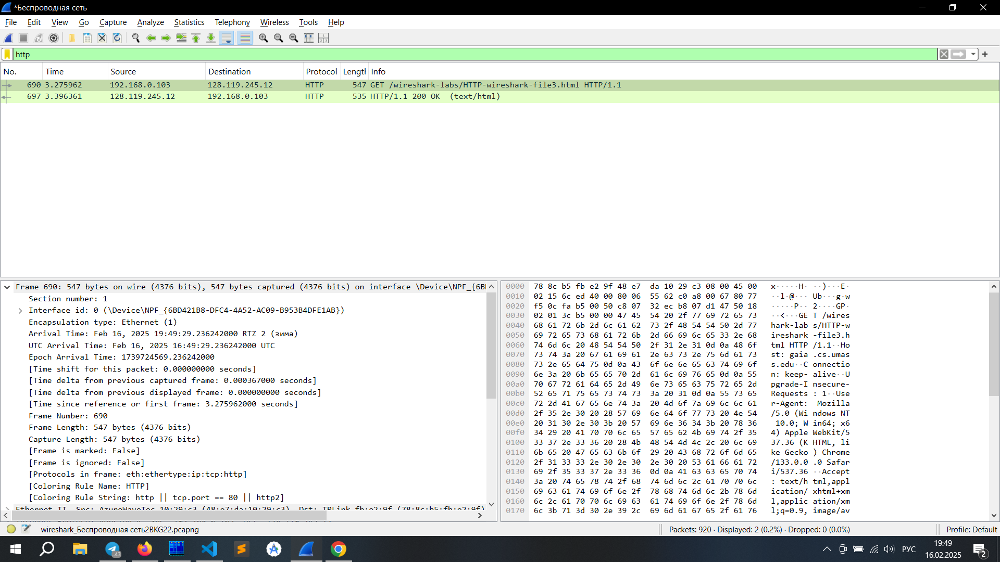

# Задание №1

1. И мой браузер, и сервер используют HTTP 1.1
2. 
    - Браузер может принимать английский и русский языки
    - Браузер сообщает поддерживаемые форматы файлов (html, xhtml+xml, webp и прочее), кодировку
3. IP моего компьютера -- 196.168.0.103, IP сервера -- 128.119.245.12
4. С сервера возвращается код состояния 200
5. Последний раз файл модифицировался 16 февраля в 6:59 утра
6. От сервера пришло 540 байл контента 

# Задание №2

1. Нет, строки IF-MODIFIED-SINCE нет
2. Да, сервер явно вернул содержимое, в тексте ответа есть html-код страницы
3. Да, во втором GET-запросе есть строка IF-MODIFIED-SINCE
4. В ответ на второй GET-запрос возвращается статус 304 Not Modified, явно сервер не возвращает содержимое файла

# Задание 3

1. Мой браузер отправил одно сообщение HTTP GET с номером 690
2. Ответ на GET-запрос имеет номер 697

3. Потребовалось 3 сегмента TCP, содержащие данные
4. Нет, таких данных нет

# Задание №4

1. Было отправлено 3 GET-запроса на адреса 128.119.245.12, 128.119.245.12 и 178.79.137.164
2. Браузер загрузил изображения параллельно (первее он начал грузить pearson.png, но первее закончилась загрузка 8E_cover_small.jpg)

# Задание №5

1. В первый раз браузер вернул код 401 Unauthorized
2. Во второй раз добавляется поле Authorization:  
